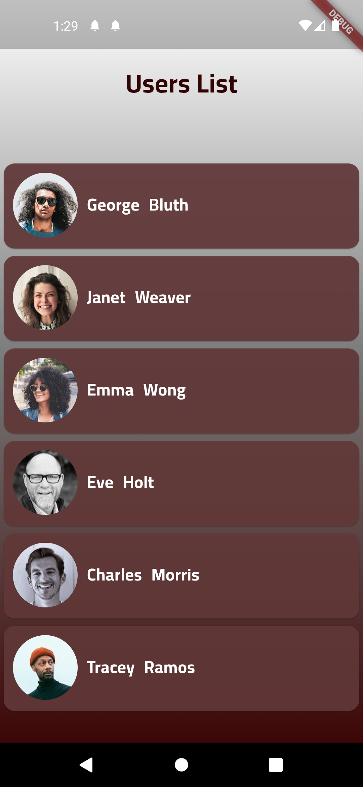
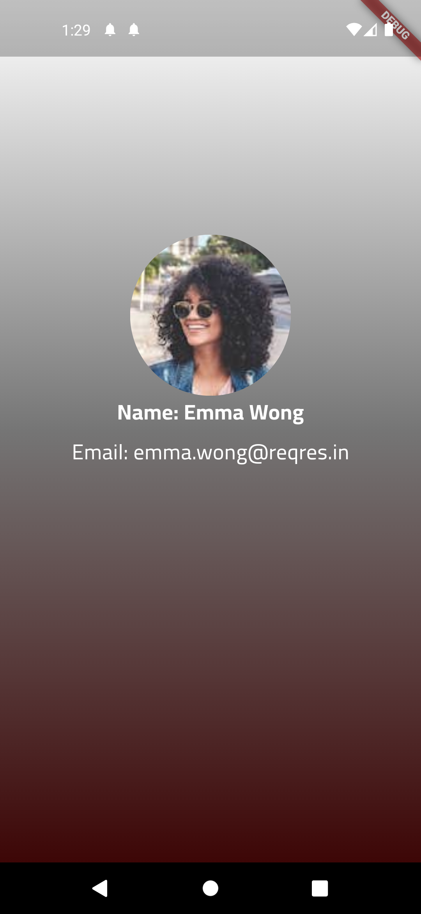

A clean, paginated User List app built with Flutter and Riverpod, consuming the ReqRes mock API. Tap a user to view full details on a dedicated screen.

---

## 📱 Screenshots

|                 Users List                |                  User Details                 |
| :---------------------------------------: | :-------------------------------------------: |
|            `list_of_users.dart`           |           `user_details_screen.dart`          |
|  |  |

---

## 🚀 Features

* **Infinite scrolling**: Automatically fetch and append pages of users.
* **Detail view**: See avatar, name, email, and more on a separate screen.
* **State management**: **Riverpod** + **Hooks**.
* **Clean architecture**:

  * **Data**: `lib/data/` models (`page.dart`, `user.dart`).
  * **Domain**: `api_data_source.dart` in `lib/domain/`.
  * **Presentation**: `lib/presentation/pages/` for screens.
  * **Providers**: Business logic in `lib/presentation/providers/`.
  * **Widgets**: Reusable UI in `lib/widgets/`.
  * **Utils**: Constants and helpers in `lib/utils/constants.dart`.
* **Custom fonts** via `google_fonts`.
* **Animations** with `flutter_animate`.
* **Launcher icons** via `icons_launcher`.

---

## 📂 Project Structure

```bash
lib/
├── data/
│   ├── page.dart         # Pagination model
│   └── user.dart         # User model
├── domain/
│   └── api_data_source.dart  # API calls to ReqRes
├── presentation/
│   └── pages/
│       ├── splash_screen.dart
│       ├── list_of_users.dart
│       └── user_details_screen.dart
├── presentation/
│   └── providers/
│       ├── api_datasource.dart
│       ├── user_list_provider.dart
│       └── user_detail_provider.dart
├── widgets/
│   ├── avatar.dart
│   └── user_item.dart
├── utils/
│   └── constants.dart
└── main.dart             # App entry point
```

---

## ⚙️ Download
[Click Here](app-release.apk)


## 📦 Dependencies

```yaml
dependencies:
  flutter:
    sdk: flutter
  cupertino_icons: ^1.0.8
  riverpod: ^2.6.1
  flutter_riverpod: ^2.6.1
  hooks_riverpod: ^2.6.1
  flutter_hooks: ^0.18.6
  google_fonts: ^6.2.1
  flutter_animate: ^4.5.2
  icons_launcher: ^3.0.1
```

---

## 🧩 How It Works

1. **SplashScreen** shows a loading indicator.
2. **ListOfUsers** (`list_of_users.dart`) uses `UserListProvider` to fetch and display paginated data.
3. Scroll to bottom triggers `fetchNextPage()` in the provider.
4. Tap a user to navigate to **UserDetailsScreen** (`user_details_screen.dart`), which uses `UserDetailProvider` to load individual user info.

---

## 📜 License

MIT © \[Hussain Tarek]
